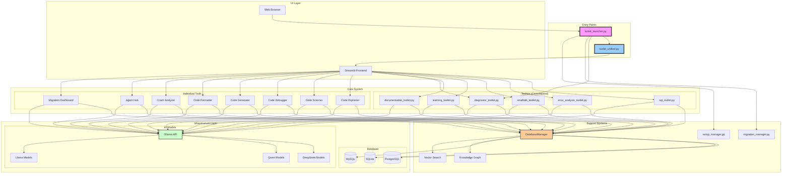
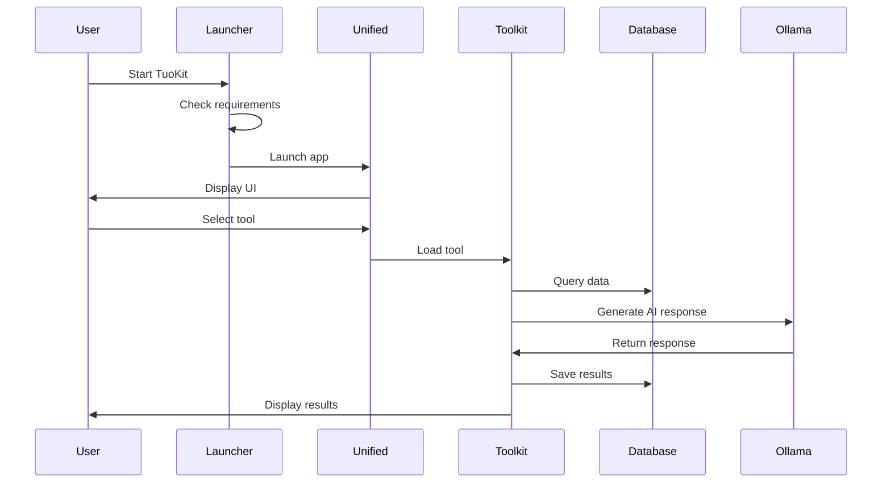
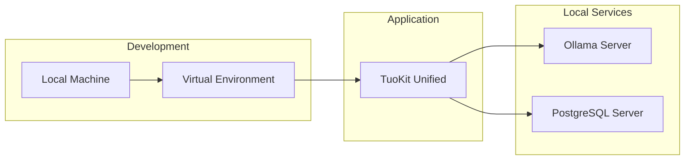

# TuoKit System Architecture

## Overview

TuoKit is a comprehensive AI-powered toolkit for developers that consolidates multiple tools and interfaces into a unified application. This document provides a detailed overview of the system architecture, components, and relationships.

## Architecture Diagram



## Component Details

### 1. Entry Points

#### tuokit_launcher.py
- **Purpose**: Universal launcher with setup, diagnostics, and launch capabilities
- **Features**:
  - Platform detection (Windows, Linux, Mac, WSL)
  - Virtual environment management
  - Dependency installation
  - Ollama connectivity checking
  - Database configuration validation
  - Interactive menu with 12 options
  - Command-line argument support

#### tuokit_unified.py
- **Purpose**: Single unified entry point for all TuoKit applications
- **Features**:
  - Hierarchical tool registry system
  - Category-based navigation
  - Built-in dashboards (Home, Analytics, Activity)
  - Centralized settings management
  - Dynamic tool loading based on type

### 2. Consolidated Toolkits

#### sql_toolkit.py
- **Consolidated from**: sql_generator.py, sql_optimizer.py, sql_pipeline.py
- **Features**:
  - Natural language to SQL conversion
  - Query optimization
  - Pipeline execution
  - Multi-database support

#### error_analysis_toolkit.py
- **Consolidated from**: error_tool.py, exception_advisor.py, crash_analyzer.py
- **Features**:
  - Error decoding and explanation
  - Exception advice and solutions
  - Enhanced crash analysis (200 chunks, 5MB files)
  - Pattern matching and synthesis

#### smalltalk_toolkit.py
- **Consolidated from**: 7 SmallTalk development tools
- **Features**:
  - Class generation
  - Method explanation
  - Code conversion
  - Refactoring
  - Meta-programming
  - Seaside framework support

#### learning_toolkit.py
- **Consolidated from**: edu_mind.py, study_guide_generator.py, sql_academy.py
- **Features**:
  - Adaptive learning with spaced repetition
  - Study guide generation
  - Interactive SQL learning
  - Progress tracking

#### documentation_toolkit.py
- **Consolidated from**: doc_tools.py, knowledge_lib.py, help_guide.py
- **Features**:
  - Document analysis and chunking
  - Knowledge management
  - Integrated help system
  - Search capabilities

#### diagnostic_toolkit.py
- **Consolidated from**: 6 diagnostic tools
- **Features**:
  - Ollama host auto-detection
  - System requirement checking
  - Database connectivity testing
  - Auto-fix capabilities
  - WSL-specific handling
  - Migration readiness assessment

### 3. Infrastructure Layer

#### Database Support
- **PostgreSQL**: Primary production database
- **SQLite**: Lightweight local storage
- **MySQL**: Alternative database option
- **Features**:
  - Automatic configuration from .env
  - Connection pooling
  - Migration support
  - Backup capabilities

#### AI Model Integration
- **Ollama API**: Local LLM interface
- **Supported Models**:
  - DeepSeek R1 (latest, 1.5b)
  - DeepSeek Coder (6.7b)
  - Qwen 2.5 Coder
  - Llama 3.2
- **Features**:
  - Model auto-detection
  - Fallback handling
  - Session-based model selection

### 4. Support Systems

#### migration_manager.py
- **Purpose**: Database migration and tool consolidation
- **Features**:
  - Version tracking
  - Dependency resolution
  - Rollback support
  - Dry-run mode
  - Backup creation
  - Integrity verification

#### setup_manager.py
- **Purpose**: System setup and configuration
- **Features**:
  - Interactive setup wizard
  - Database initialization
  - Environment configuration
  - Multi-platform support

### 5. Data Flow



## Key Design Patterns

### 1. Tool Registry Pattern
```python
TOOL_REGISTRY = {
    "category_id": {
        "name": "Category Name",
        "tools": {
            "tool_id": {
                "type": "page|toolkit|internal",
                "function": "handler_function"
            }
        }
    }
}
```

### 2. Consolidation Pattern
- Multiple related tools merged into cohesive toolkits
- Shared configuration and utilities
- Reduced code duplication
- Improved maintainability

### 3. Migration Pattern
- Version-based migrations
- Dependency tracking
- Rollback capabilities
- Automated backups

## Security Considerations

### 1. Database Security
- Credentials stored in .env file
- Password-based authentication
- Connection encryption support

### 2. Model Security
- Local Ollama deployment
- No external API dependencies
- Session-based model selection

### 3. File System Security
- Permission checking in diagnostics
- Backup before modifications
- Rollback capabilities

## Performance Optimizations

### 1. Lazy Loading
- Tools loaded only when selected
- Dynamic imports for better startup time
- Session state caching

### 2. Database Optimization
- Connection pooling
- Indexed queries
- Batch operations

### 3. Chunking Strategy
- Large file handling (5MB+)
- 200 chunks with 26,000 chars each
- Synthesis for comprehensive analysis

## Deployment Architecture



## Monitoring and Diagnostics

### 1. Built-in Analytics
- Usage tracking by tool
- Model usage distribution
- Knowledge base growth
- Daily activity trends

### 2. Diagnostic Toolkit
- System health checks
- Connectivity testing
- Auto-fix capabilities
- Report generation

### 3. Activity Logging
- Query history
- Knowledge saves
- Tool usage patterns
- Error tracking

## Future Architecture Considerations

### 1. Scalability
- Plugin system for new tools
- Distributed processing support
- Cloud deployment options
- API gateway integration

### 2. Enhanced Features
- Real-time collaboration
- Version control integration
- CI/CD pipeline support
- Advanced caching strategies

### 3. Integration Points
- IDE plugins
- CLI tools
- Web API
- Mobile interfaces

## Configuration Management

### Environment Variables
```bash
# Database Configuration
TUOKIT_DB_TYPE=postgresql
TUOKIT_PG_HOST=localhost
TUOKIT_PG_PORT=5432
TUOKIT_PG_DB=tuokit_knowledge
TUOKIT_PG_USER=tuokit_user
TUOKIT_PG_PASSWORD=secure_password

# Ollama Configuration
TUOKIT_OLLAMA_HOST=http://localhost:11434

# Feature Toggles
TUOKIT_ENABLE_ANALYTICS=true
TUOKIT_ENABLE_EXPERIMENTAL=false
```

### Session State
- Model selection
- Tool navigation
- User preferences
- Temporary data

## Conclusion

TuoKit's architecture emphasizes modularity, extensibility, and user experience. The consolidation of 50+ individual tools into organized toolkits, combined with a unified entry point and comprehensive launcher, creates a powerful yet manageable system for AI-assisted development.

The architecture supports multiple deployment scenarios, from local development to potential cloud deployment, while maintaining security and performance standards. The diagnostic and migration systems ensure smooth operations and easy maintenance.