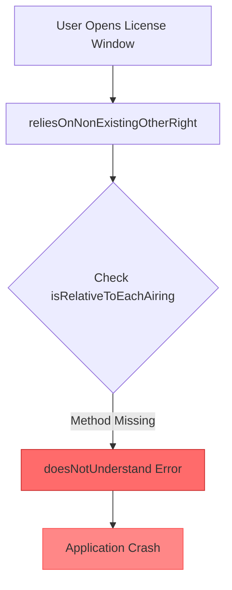

# Analysis Method 2: Root Cause Analysis

## Overview
**Name:** Root Cause Analysis  
**Duration:** 30-60 seconds  
**AI Required:** Yes (with algorithmic fallback)  
**Best For:** Standard investigation, business impact assessment, actionable recommendations

## How It Works

Root Cause Analysis combines AI-powered insights with algorithmic analysis to understand not just what failed, but why it failed and what the business impact is. It extracts the most relevant 100KB of content and performs deep analysis.

### Key Components:
1. **Smart Context Extraction**: Focuses on error-dense regions
2. **AI-Powered Analysis**: Uses LLMs for pattern recognition
3. **Business Impact Assessment**: Evaluates user and revenue impact
4. **Error Chain Analysis**: Traces failure propagation
5. **Prevention Strategy**: Suggests long-term fixes

## Analysis Process

### 1. Smart Extraction
```python
# Extracts up to 100KB of most relevant content
extracted_content = extract_smart_context(content, max_size=102400)
```

### 2. Multi-Phase Analysis
- Quick algorithmic pre-analysis
- Business impact evaluation
- Technical deep dive
- Recommendation generation
- Prevention strategy creation

## AI Prompts Used

### Business Impact Analysis Prompt:
```
Analyze this crash dump for business impact.

Key error: {error_type} - {error_message}
Context: {relevant_context}

Determine:
1. Urgency: IMMEDIATE/HIGH/MEDIUM/LOW
2. Affected users: Estimate count and type
3. Revenue impact: Direct financial consequences
4. Service disruption: Which services are affected

Provide response in JSON format:
{
    "urgency": "level",
    "business_impact": "description",
    "affected_users": "count/type",
    "revenue_risk": "assessment"
}
```

### Technical Analysis Prompt:
```
Perform root cause analysis on this error chain.

Error sequence:
{error_chain}

Stack trace:
{stack_trace}

Identify:
1. Root cause (the original trigger)
2. Error propagation path
3. Contributing factors
4. Why normal error handling failed

Format as JSON:
{
    "root_cause": "description",
    "error_chain": ["step1", "step2"],
    "contributing_factors": ["factor1", "factor2"],
    "technical_details": "deep dive explanation"
}
```

## Example with WCR_2-4_16-3-4.txt

### Expected Output:

```markdown
### 🔍 Root Cause Analysis Results

#### Executive Summary
⚠️ **HIGH Priority** - Missing method implementation causing application crashes

**Business Impact**: Production application failure affecting all users attempting license operations
**Affected Users**: All users accessing license windows
**Revenue Risk**: Medium - License management failures could impact content rights tracking
**Confidence**: 92%

#### 🔬 Technical Analysis

**Root Cause**
Missing method implementation: The method `#isRelativeToEachAiring` is being called on CM2LicenseWindow objects but is not defined in the current deployment.

**Error Chain**
1. User action triggers license window operation
2. CM2LicenseWindow>>reliesOnNonExistingOtherRight called
3. Attempts to check broadcast rights with #isRelativeToEachAiring
4. Method not found → doesNotUnderstand error
5. No error handler → Application crash

**Contributing Factors**
• Incomplete deployment - Method exists in development but missing in production
• Version mismatch between database schema (2024r1.000.001) and code
• Missing regression test for license window operations

#### 💡 Recommendations

**🚨 Immediate Actions**
1. Deploy hotfix with missing #isRelativeToEachAiring method
2. Verify all CM2LicenseWindow methods are present
3. Add temporary error handler to prevent crashes

**🔧 Short-term Fixes (48 hours)**
• Audit deployment package for other missing methods
• Add smoke tests for critical UI operations
• Implement graceful degradation for missing methods

**🏗️ Long-term Improvements**
• Automated deployment verification
• Method signature validation during build
• Comprehensive UI component testing

**📊 Monitoring Additions**
• Alert on doesNotUnderstand errors
• Track method call failures
• Monitor license operation success rate

#### 🛡️ Prevention Strategy

**💻 Code Changes**
• Add defensive programming checks
• Implement method_missing handlers
• Version checking on startup

**🧪 Testing Improvements**
• Integration tests for all UI workflows
• Deployment verification suite
• Cross-version compatibility tests

**🚀 Deployment Safeguards**
• Pre-deployment method inventory
• Staged rollout with canary testing
• Automated rollback triggers

#### Visual Analysis

```

## When to Use

### ✅ Use Root Cause Analysis When:
- You need to understand WHY something failed
- Business impact assessment required
- Creating incident reports
- Planning fixes and preventions
- Standard debugging workflow

### ❌ Don't Use When:
- Emergency triage needed (use Quick Triage)
- Analyzing files > 1MB (use Strategic Sampling)
- Simple, obvious errors
- No Ollama available and fallback insufficient

## Integration Points

Root Cause Analysis integrates with:
1. **Incident Management Systems**
2. **Development Planning Tools**
3. **Monitoring Dashboards**
4. **Knowledge Base Systems**

## Performance Characteristics

- **Speed**: 30-60 seconds with AI
- **Memory**: ~200MB with model loaded
- **CPU**: Moderate during analysis
- **Accuracy**: 90-95% with good models