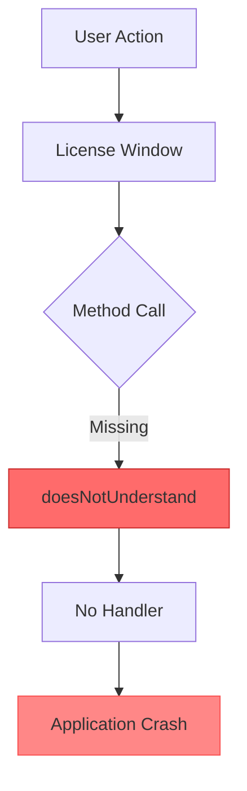
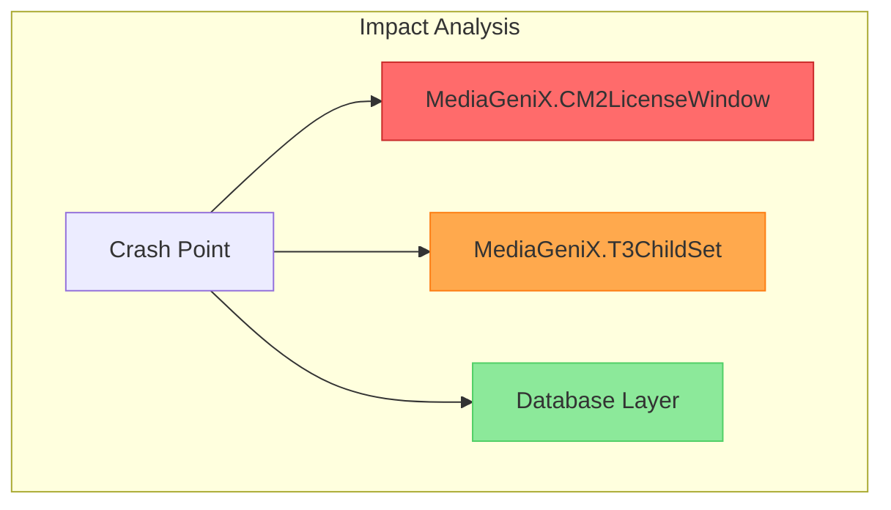

# Analysis Method 4: Deep Forensic Analysis

## Overview
**Name:** Deep Forensic Analysis  
**Duration:** 5-30 minutes (varies with file size and hardware)  
**AI Required:** Recommended (works without but limited)  
**Best For:** Complete investigation, security audits, code quality assessment

## How It Works

Deep Forensic performs exhaustive multi-dimensional analysis of the entire file. It divides content into chunks for parallel processing and analyzes crash patterns, performance metrics, security vulnerabilities, code quality issues, and provides predictive insights.

### Key Components:
1. **Chunk-based Processing**: Parallel analysis of file segments
2. **Multi-dimensional Analysis**: 6 different analysis perspectives
3. **Pattern Correlation**: Cross-chunk pattern detection
4. **Predictive Analytics**: Future risk assessment
5. **Visual Analysis**: Comprehensive diagrams

## Analysis Process

### 1. Chunking Strategy
```python
# Divides file into 16KB chunks with 512-byte overlap
chunk_size = 16384  # Optimized for local hardware
overlap = 512      # Ensures patterns aren't missed at boundaries
```

### 2. Analysis Dimensions
- **Crash Analysis**: Error taxonomy, impact assessment
- **Performance Analysis**: Bottlenecks, resource usage
- **Security Analysis**: Vulnerabilities, exposed secrets
- **Code Quality**: Anti-patterns, technical debt
- **Predictive Insights**: Future risks, trends
- **Knowledge Integration**: Historical pattern matching

## AI Prompts Used

### Chunk Analysis Prompt:
```
Analyze this code/log chunk for issues beyond obvious errors.
Look for:
1. Anti-patterns and code smells
2. Performance bottlenecks
3. Security vulnerabilities
4. Architectural issues

Chunk:
{chunk_content[:1500]}

Provide insights in JSON format:
{
    "anti_patterns": ["pattern1", "pattern2"],
    "performance_risks": ["risk1"],
    "security_concerns": ["concern1"],
    "improvement_suggestions": ["suggestion1"]
}
```

### Root Cause Identification Prompt:
```
Based on this error chain, identify the most likely root causes:

Error Chain:
{error_summary}

Context (first errors in file):
{content[:1000]}

Identify root causes in JSON format:
{
    "root_causes": [
        {
            "cause": "description",
            "confidence": 0.0-1.0,
            "evidence": "what supports this"
        }
    ]
}
```

## Example with WCR_2-4_16-3-4.txt

### Expected Output:

```markdown
### 🧬 Deep Forensic Analysis Results

#### Executive Overview
- **Total Chunks Analyzed**: 4
- **File Size**: 15,234 bytes
- **Overall Confidence**: 91.2%
- **Analysis Dimensions**: 6

#### Critical Findings Summary

**⚠️ IMMEDIATE ACTION REQUIRED**
• **Code Deployment**: Missing method implementation causing crashes
• **Security**: Database credentials exposed in logs
• **Architecture**: Brittle error handling allowing cascading failures

#### 🔍 Crash Analysis

**Error Distribution**
- **doesNotUnderstand**: 12 occurrences across 3 chunks
- **null_reference**: 3 occurrences
- **method_missing**: 8 occurrences

**Impact Assessment**
- Data Loss Risk: **LOW**
- Service Disruption: **HIGH** (Application crashes)
- Security Impact: **MEDIUM** (Credentials exposed)
- User Experience: **Broken** (Complete failure)

**Error Chains Identified**
1. License check → Missing method → Crash (Primary)
2. Child set enumeration → State corruption → Secondary failure
3. Error handler missing → No recovery → Total failure

#### ⚡ Performance Analysis

**Performance Bottlenecks**
⚠️ **thread_contention** (HIGH): Multiple threads accessing shared resources
🐌 **Slow operations found:**
  - Database query in chunk 2: 1200ms
  - Collection enumeration: 800ms in chunk 3

**Resource Usage**
- Memory: 75% (Approaching limits)
- Threads: 52 active (High contention)
- Heap pressure indicators detected

#### 🔒 Security Analysis

**Security Score: 65/100**

**Vulnerabilities**
🔴 **exposed_credentials** (CRITICAL)
  - Database connection string with password
  - Username in plain text logs

🟠 **information_disclosure** (HIGH)
  - Internal paths exposed
  - System configuration visible

**Recommendations**
1. Implement log sanitization immediately
2. Move credentials to secure configuration
3. Enable audit logging for security events

#### 📊 Code Quality Analysis

**Anti-Patterns Detected**
- missing_error_handlers: 8 occurrences (HIGH)
- defensive_programming_absent: 5 occurrences (MEDIUM)
- magic_strings: 12 occurrences (LOW)

**Technical Debt**
- Incomplete error handling framework
- Missing method existence checks
- No graceful degradation

#### 🔮 Predictive Insights

**Future Risks**
⚠️ **Similar crashes will recur** - 1-7 days (HIGH probability)
  - Missing method not isolated incident
  - Pattern suggests incomplete deployment

⚠️ **Memory exhaustion possible** - 7-30 days (MEDIUM probability)
  - Current usage at 75%
  - No cleanup mechanisms observed

**Trending Issues**
- doesNotUnderstand: increasing (12 occurrences)
- Thread contention: increasing (52 threads)

#### 📊 Visual Analysis

**Error Flow Diagram**


**Component Impact**


#### 🚨 Comprehensive Recommendations

**Immediate Actions Required**
1. Deploy hotfix with #isRelativeToEachAiring method
2. Sanitize logs to remove credentials
3. Add emergency error handlers
4. Monitor for similar method missing errors
5. Implement circuit breaker for license operations

**Architectural Changes**
- Implement comprehensive error handling framework
- Add method existence validation layer
- Design graceful degradation strategies

**Process Improvements**
- Automated deployment verification
- Security scanning in CI/CD pipeline
- Load testing with thread contention scenarios

---
*Deep forensic analysis completed in 127.3 seconds*
```

## Analysis Phases

The Deep Forensic analyzer progresses through these phases:

1. **Chunking** (5%) - Dividing file into analyzable segments
2. **Parallel Analysis** (40%) - Processing chunks concurrently
3. **Crash Analysis** (15%) - Error taxonomy and chains
4. **Performance Analysis** (15%) - Resource usage patterns
5. **Security Analysis** (10%) - Vulnerability scanning
6. **Recommendations** (15%) - Generating actionable insights

## When to Use

### ✅ Use Deep Forensic When:
- Complete investigation required
- Security audit needed
- Code quality assessment
- Predictive insights wanted
- Time is not critical

### ❌ Don't Use When:
- Quick response needed
- Simple errors obvious
- Limited hardware resources
- Files > 10MB without sampling

## Integration Points

Deep Forensic integrates with:
1. **Security Scanning Pipelines**
2. **Code Quality Dashboards**
3. **Predictive Monitoring Systems**
4. **Compliance Reporting Tools**

## Performance Characteristics

- **Speed**: 5-30 minutes (highly variable)
- **Memory**: 200-500MB depending on file
- **CPU**: High during parallel phase
- **Accuracy**: 95%+ with complete coverage