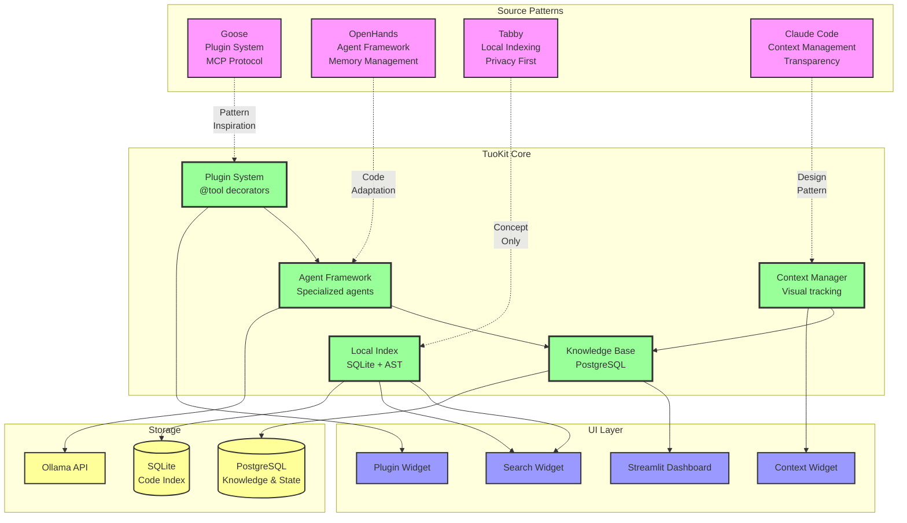

# TuoKit Architecture - Pattern Extraction Visualization



## Pattern Extraction Summary

### 🔄 Transformation Types

1. **Pattern Inspiration** (Goose → Plugin System)
   - Study the concept, implement from scratch
   - No code reuse (different language)
   
2. **Code Adaptation** (OpenHands → Agent Framework)
   - Actual Python code we can modify
   - Remove complexity, keep patterns
   
3. **Concept Only** (Tabby → Local Index)
   - Understand the approach
   - Write our own implementation
   
4. **Design Pattern** (Claude Code → Context Manager)
   - Learn from documentation
   - Implement similar UX

### 🎯 Integration Points

```
TuoKit Core = Plugin System + Agent Framework + Context Manager + Local Index + Knowledge Base
```

Each component is:
- **Inspired by** best practices from existing tools
- **Implemented in** pure Python for simplicity
- **Integrated with** Streamlit for UI
- **Stored in** PostgreSQL/SQLite for persistence

### 🚀 Why This Works

1. **No Frankenstein Effect**: Coherent architecture, not merged codebases
2. **Best of All Worlds**: Cherry-picked patterns that complement each other
3. **Practical Implementation**: Everything implementable in Python
4. **Incremental Development**: Can build one component at a time

### 📊 Complexity Analysis

| Component | Source | Complexity | Time Estimate |
|-----------|--------|------------|---------------|
| Plugin System | Goose | Low | 2-3 days |
| Agent Framework | OpenHands | Medium | 3-4 days |
| Context Manager | Claude Code | High | 4-5 days |
| Local Index | Tabby | Medium | 3-4 days |
| Knowledge Base | Multiple | Low | 2-3 days |
| **Total** | - | **Medium** | **14-19 days** |

### 🏁 Starting Point

```python
# Day 1: Create this file to prove the concept
# tuokit/core/__init__.py

from tuokit.plugins import PluginManager
from tuokit.agents import AgentOrchestrator  
from tuokit.context import ContextManager
from tuokit.indexing import LocalCodeIndex
from tuokit.knowledge import KnowledgeBase

class TuoKit:
    """
    The TuoKit Architect has learned from:
    - Goose's modularity
    - OpenHands' intelligence
    - Tabby's privacy
    - Claude Code's transparency
    
    And created something uniquely valuable.
    """
    
    def __init__(self, config):
        self.plugins = PluginManager()
        self.agents = AgentOrchestrator()
        self.context = ContextManager()
        self.index = LocalCodeIndex(config['project_path'])
        self.knowledge = KnowledgeBase(config['db_url'])
        
    def run(self):
        """Start the TuoKit experience"""
        import streamlit as st
        st.set_page_config(page_title="TuoKit", layout="wide")
        # The journey begins...
```
