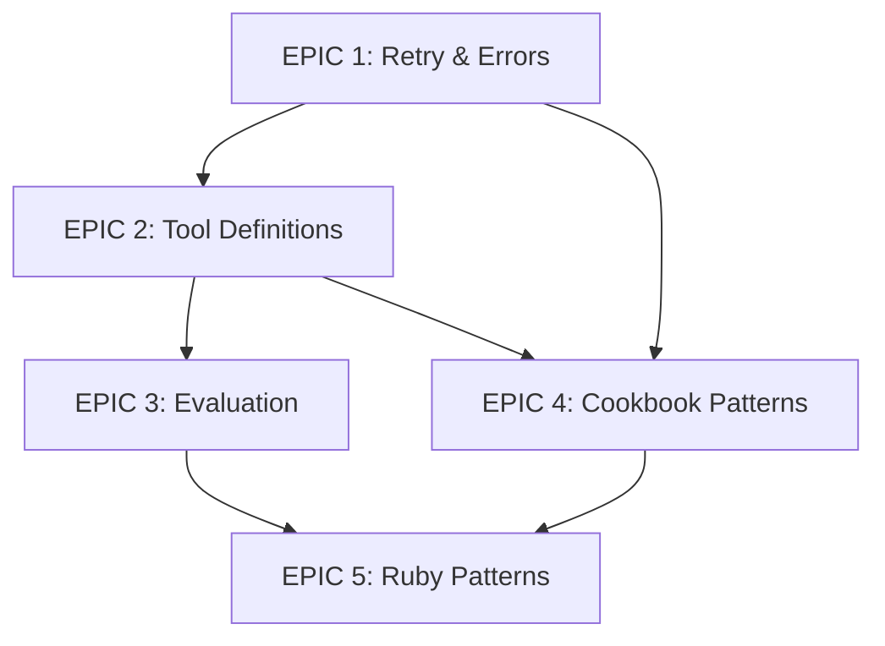

# 🏛️ Anthropic SDK Patterns Implementation Project

## Project Overview
Systematically integrate valuable patterns from Anthropic's repositories into TuoKit, maintaining our philosophy of "build fast, build smart, build exactly what's needed."

---

## EPIC 1: Enhanced Retry & Error Handling System
*Upgrade TuoKit's error handling to enterprise-grade reliability*

### Quality Gates:
- [ ] All retry logic includes jitter to prevent thundering herd
- [ ] Error messages are user-friendly AND technically detailed
- [ ] Graceful degradation paths for all failure modes
- [ ] No external dependencies beyond Python stdlib

### TASK 1.1: Advanced Retry Logic Implementation
**Goal:** Replace simple exponential backoff with jitter-aware retry system

#### SUBTASK 1.1.1: Create retry_advanced.py
```
Create utils/retry_advanced.py with:
- Exponential backoff with jitter
- Error-type aware retry strategies
- Circuit breaker pattern
- Retry budget tracking

Quality checks:
- Works with both sync and async functions
- Configurable per error type
- Logs retry attempts appropriately
- Thread-safe implementation
```

#### SUBTASK 1.1.2: Integrate with Ollama calls
```
Update utils/ollama.py to use advanced retry:
- Different strategies for timeout vs rate limit
- Jitter prevents simultaneous retries
- Track retry metrics

Quality checks:
- Existing functionality preserved
- Performance not degraded
- Clear logging of retry reasons
```

#### SUBTASK 1.1.3: Create retry configuration system
```
Add to config/:
- retry_config.yaml with sensible defaults
- Per-tool retry customization
- Environment variable overrides

Quality checks:
- Config validates on load
- Defaults work for 90% of cases
- Easy to understand structure
```

### TASK 1.2: Structured Error Hierarchy
**Goal:** Implement Anthropic-style error classes across TuoKit

#### SUBTASK 1.2.1: Create base error system
```
Create utils/errors.py with:
- TuoKitError base class
- Specific error types for each domain
- user_friendly_message() method
- technical_details() method
- suggested_actions() method

Quality checks:
- Every error has helpful suggestions
- Errors are serializable
- Stack traces preserved
- Follows Python error best practices
```

#### SUBTASK 1.2.2: Migrate existing tools
```
For each tool in pages/:
- Replace generic exceptions
- Add domain-specific errors
- Ensure user-friendly messages
- Add recovery suggestions

Quality checks:
- No breaking changes
- Better error messages
- Consistent error handling
- All errors logged properly
```

---

## EPIC 2: Structured Tool Definition System
*Standardize how TuoKit tools define and expose their capabilities*

### Quality Gates:
- [ ] Tools are self-documenting
- [ ] Capabilities are discoverable programmatically
- [ ] No boilerplate code required
- [ ] Backwards compatible with existing tools

### TASK 2.1: Tool Schema Definition
**Goal:** Create standardized tool definition format

#### SUBTASK 2.1.1: Design tool schema
```
Create utils/tool_schema.py:
- JSON Schema for tool definitions
- Input/output specifications
- Required/optional parameters
- Type hints integration

Example:
{
  "name": "crash_analyzer",
  "description": "Analyzes crash logs",
  "inputs": {
    "log_content": {"type": "string", "required": true},
    "analysis_depth": {"type": "enum", "values": ["quick", "deep"], "default": "quick"}
  },
  "outputs": {
    "root_cause": {"type": "string"},
    "suggestions": {"type": "array", "items": {"type": "string"}}
  }
}

Quality checks:
- Schema validates with jsonschema
- Supports all TuoKit use cases
- Easy to write by hand
- Can generate from docstrings
```

#### SUBTASK 2.1.2: Create tool registry
```
Enhance utils/tool_registry.py:
- Auto-discover tool schemas
- Validate on registration
- Query capabilities by need
- Generate documentation

Quality checks:
- Fast tool discovery
- No manual registration needed
- Supports dynamic loading
- Thread-safe operations
```

#### SUBTASK 2.1.3: Add schema to existing tools
```
For each tool:
- Add TOOL_SCHEMA definition
- Validate inputs match schema
- Update docstrings to match
- Test schema accuracy

Quality checks:
- All tools have schemas
- Schemas are accurate
- No functionality changes
- Documentation improved
```

### TASK 2.2: Tool Composition System
**Goal:** Enable tools to use other tools programmatically

#### SUBTASK 2.2.1: Create tool client
```
Create utils/tool_client.py:
- Load tool by name
- Validate inputs against schema
- Execute with error handling
- Return typed outputs

Quality checks:
- Type-safe tool calling
- Automatic validation
- Good error messages
- Async support
```

#### SUBTASK 2.2.2: Add composition examples
```
Create examples/tool_composition.py:
- Chain multiple tools
- Conditional tool selection
- Parallel tool execution
- Error recovery flows

Quality checks:
- Examples are practical
- Show best practices
- Include error handling
- Well documented
```

---

## EPIC 3: Evaluation Framework
*Test and measure the quality of TuoKit's outputs*

### Quality Gates:
- [ ] Automated testing of generated code
- [ ] Quality metrics tracking
- [ ] Regression detection
- [ ] Easy to add new test cases

### TASK 3.1: Code Quality Evaluator
**Goal:** Automatically test generated code

#### SUBTASK 3.1.1: Create evaluation framework
```
Create toolkits/evaluator/:
- Base evaluation classes
- Language-specific evaluators
- Metric collectors
- Report generators

Quality checks:
- Extensible architecture
- Language agnostic core
- Clear metrics definitions
- Fast execution
```

#### SUBTASK 3.1.2: Python code evaluator
```
Create evaluators/python_evaluator.py:
- Syntax validation
- Style checking (PEP8)
- Complexity metrics
- Test generation
- Security scanning

Quality checks:
- Uses ast module
- No external linters needed
- Clear pass/fail criteria
- Helpful error messages
```

#### SUBTASK 3.1.3: Ruby/Rails evaluator
```
Create evaluators/ruby_evaluator.py:
- Ruby syntax checking
- Rails best practices
- Performance indicators
- Security checks

Quality checks:
- Handles Ruby and ERB
- Rails-aware checks
- Version compatibility
- Fast execution
```

### TASK 3.2: Output Quality Tracking
**Goal:** Track tool quality over time

#### SUBTASK 3.2.1: Metrics collection
```
Create utils/metrics_collector.py:
- Track generation success rate
- Measure user satisfaction
- Code quality scores
- Performance metrics

Quality checks:
- Minimal performance impact
- Privacy preserving
- Useful aggregations
- Export capabilities
```

#### SUBTASK 3.2.2: Quality dashboard
```
Create pages/quality_dashboard.py:
- Show tool quality trends
- Identify problem areas
- User feedback integration
- Export reports

Quality checks:
- Real-time updates
- Clear visualizations
- Actionable insights
- Fast loading
```

---

## EPIC 4: Cookbook Pattern Integration
*Implement proven patterns from Anthropic's cookbook*

### Quality Gates:
- [ ] Patterns adapted to TuoKit style
- [ ] No unnecessary complexity
- [ ] Clear documentation
- [ ] Practical examples

### TASK 4.1: Multimodal Support
**Goal:** Add image + text processing capabilities

#### SUBTASK 4.1.1: Image input handling
```
Create utils/multimodal.py:
- Image loading and validation
- Format conversion
- Size optimization
- Base64 encoding for LLMs

Quality checks:
- Supports common formats
- Memory efficient
- Error handling
- Progress feedback
```

#### SUBTASK 4.1.2: Screenshot analyzer tool
```
Create toolkits/screenshot_analyzer/:
- UI element detection
- Text extraction
- Error identification
- Suggestion generation

Quality checks:
- Works with all TuoKit tools
- Fast processing
- Accurate detection
- Helpful output
```

### TASK 4.2: Prompt Caching System
**Goal:** Reuse expensive LLM computations

#### SUBTASK 4.2.1: Cache infrastructure
```
Create utils/prompt_cache.py:
- Content-based cache keys
- TTL support
- Size limits
- Cache invalidation

Quality checks:
- Thread-safe
- Memory efficient
- Fast lookups
- Easy to disable
```

#### SUBTASK 4.2.2: Smart cache integration
```
Update utils/ollama.py:
- Automatic cache checks
- Partial match support
- Cache warming
- Hit rate tracking

Quality checks:
- Transparent to users
- Significant speedup
- No stale results
- Configurable behavior
```

---

## EPIC 5: Ruby SDK Pattern Adoption
*Improve Ruby/Rails tool generation using Ruby SDK patterns*

### Quality Gates:
- [ ] Generated code follows Ruby idioms
- [ ] Rails best practices enforced
- [ ] Modern Ruby features used appropriately
- [ ] Backwards compatibility maintained

### TASK 5.1: Ruby Code Generation Enhancement
**Goal:** Generate more idiomatic Ruby code

#### SUBTASK 5.1.1: Ruby idiom library
```
Create toolkits/ruby_toolkit/idioms.py:
- Common Ruby patterns
- Rails conventions
- Modern syntax preferences
- Anti-pattern detection

Quality checks:
- Covers 90% of use cases
- Version aware
- Well documented
- Easy to extend
```

#### SUBTASK 5.1.2: Update generators
```
For each Ruby/Rails tool:
- Use idiom library
- Improve generated code style
- Add better comments
- Include usage examples

Quality checks:
- Code more readable
- Follows style guides
- No functionality changes
- Better documentation
```

---

## Implementation Order & Dependencies



## Success Metrics

1. **Error Reduction**: 50% fewer unhandled errors
2. **Tool Discovery**: 100% of tools have schemas
3. **Quality Scores**: Average tool quality >8/10
4. **Performance**: No regression in response times
5. **User Satisfaction**: Positive feedback on improvements

## TuoKit Philosophy Checkpoints

### Before Starting Each EPIC:
- [ ] Will this make tools easier to use?
- [ ] Are we adding necessary complexity only?
- [ ] Can we implement without external dependencies?
- [ ] Will existing tools continue to work?

### After Completing Each TASK:
- [ ] Is the code simple and clear?
- [ ] Did we maintain backwards compatibility?
- [ ] Are error messages helpful?
- [ ] Is it well documented?

### Final Integration Checklist:
- [ ] All tests pass
- [ ] Documentation updated
- [ ] Examples provided
- [ ] No performance regression
- [ ] Follows TuoKit patterns

---

## Timeline Estimate

- EPIC 1: 2-3 days (Critical foundation)
- EPIC 2: 3-4 days (Core infrastructure)
- EPIC 3: 3-4 days (Quality assurance)
- EPIC 4: 2-3 days (Enhancements)
- EPIC 5: 2 days (Polish)

**Total: 12-16 days of focused development**

---

*Remember: We're not building Anthropic SDK - we're stealing the best parts and making them work the TuoKit way!*