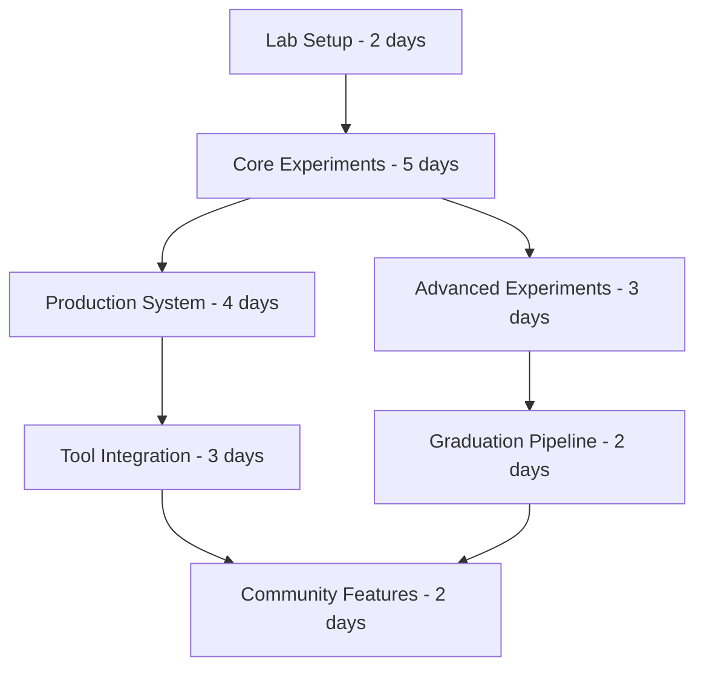

# 🧠 DSPy Implementation Project

## Project Overview
Implement a dual DSPy system: a full experimental lab for exploration and a lightweight production system that makes every TuoKit tool self-optimizing without adding complexity.

---

## EPIC 1: DSPy Experimental Laboratory
*Create an isolated environment for full DSPy experimentation*

### Quality Gates:
- [ ] Completely isolated from main TuoKit
- [ ] Full DSPy capabilities available
- [ ] Comprehensive documentation of findings
- [ ] Easy to graduate features to production

### TASK 1.1: Laboratory Infrastructure
**Goal:** Set up isolated DSPy experimentation environment

#### SUBTASK 1.1.1: Create laboratory structure
```
Create toolkits/experimental/dspy_lab/:
- __init__.py (with warning about experimental nature)
- requirements_lab.txt (DSPy and dependencies)
- README.md (laboratory guidelines)
- experiments/ (for individual experiments)
- results/ (for experiment outcomes)

Quality checks:
- No imports from main TuoKit allowed into lab
- Lab can import from TuoKit (one-way)
- Clear documentation of experimental status
- Git ignores large model files
```

#### SUBTASK 1.1.2: DSPy installation wrapper
```
Create dspy_lab/setup_lab.py:
- Check for GPU availability
- Install DSPy with correct backend
- Download required models
- Verify installation
- Create jupyter environment

Quality checks:
- Works on CPU and GPU
- Clear hardware requirements
- Handles missing dependencies gracefully
- Provides performance expectations
```

#### SUBTASK 1.1.3: Base experiment template
```
Create dspy_lab/experiment_template.py:
- Standard experiment structure
- Metrics collection
- Result documentation
- Comparison with baseline

Template includes:
- Hypothesis statement
- DSPy program definition
- Evaluation metrics
- Result interpretation
- Production readiness assessment

Quality checks:
- Easy to copy and modify
- Enforces scientific method
- Automated result tracking
- Clear success criteria
```

### TASK 1.2: Core DSPy Experiments
**Goal:** Test DSPy's most powerful features

#### SUBTASK 1.2.1: Automatic prompt optimization
```
Create experiments/prompt_optimization.py:
- Compare manual vs DSPy prompts
- Test on TuoKit crash analyzer task
- Measure quality improvements
- Document optimal strategies

Experiment:
1. Manual prompt for crash analysis
2. DSPy optimized prompt
3. Compare accuracy, completeness
4. Extract optimization patterns

Quality checks:
- Reproducible results
- Statistical significance
- Clear improvements shown
- Patterns documented
```

#### SUBTASK 1.2.2: Chain-of-thought experiments
```
Create experiments/chain_of_thought.py:
- Test CoT for debugging tasks
- Multi-hop reasoning for architecture
- Self-consistency checking
- Performance impact measurement

Quality checks:
- Clear reasoning traces
- Improved accuracy metrics
- Performance acceptable
- Integration path clear
```

#### SUBTASK 1.2.3: Few-shot learning optimization
```
Create experiments/few_shot_learning.py:
- Automatic example selection
- Dynamic shot count
- Cross-tool example sharing
- Quality vs example count

Quality checks:
- Optimal shot counts found
- Example quality metrics
- Memory efficiency
- Generalization tested
```

### TASK 1.3: Advanced DSPy Features
**Goal:** Explore cutting-edge DSPy capabilities

#### SUBTASK 1.3.1: Multi-stage reasoning
```
Create experiments/multi_stage.py:
- Complex tool chains
- Conditional reasoning paths
- Error recovery flows
- Performance optimization

Test case: Full app debugging
1. Error identification
2. Root cause analysis  
3. Solution generation
4. Code fix creation
5. Test generation

Quality checks:
- Each stage improves output
- Failures handled gracefully
- Total time acceptable
- Clear stage benefits
```

#### SUBTASK 1.3.2: Ensemble methods
```
Create experiments/ensemble.py:
- Multiple prompt strategies
- Voting mechanisms
- Confidence scoring
- Disagreement handling

Quality checks:
- Ensemble beats individuals
- Confidence correlates with accuracy
- Cost/benefit acceptable
- Implementation complexity reasonable
```

---

## EPIC 2: Lightweight Production System
*Build simple self-optimizing system for all TuoKit tools*

### Quality Gates:
- [ ] Zero configuration required
- [ ] No external dependencies
- [ ] Imperceptible performance impact
- [ ] Automatic improvement from usage

### TASK 2.1: Core Optimization Engine
**Goal:** Create minimal self-optimizing system

#### SUBTASK 2.1.1: Optimization framework
```
Create utils/optimization.py:
- Simple feedback collection
- Pattern extraction
- Prompt refinement
- Storage mechanism

Core classes:
- OptimizableOperation
- FeedbackCollector  
- PatternExtractor
- PromptRefiner

Quality checks:
- Under 500 lines total
- No ML libraries needed
- Fast execution
- Thread safe
```

#### SUBTASK 2.1.2: Feedback integration
```
Update utils/tool_base.py:
- Add feedback hooks
- Automatic optimization calls
- Success/failure tracking
- Learning persistence

Quality checks:
- Transparent to tool developers
- No breaking changes
- Minimal overhead
- Secure storage
```

#### SUBTASK 2.1.3: Pattern learning system
```
Create utils/pattern_learner.py:
- Extract successful patterns
- Identify failure patterns
- Generate improvements
- Apply incrementally

Quality checks:
- No training required
- Rules-based approach
- Explainable decisions
- Gradual improvements
```

### TASK 2.2: Tool Integration Framework
**Goal:** Make optimization automatic for all tools

#### SUBTASK 2.2.1: Decorator system
```
Create utils/optimizable.py:
- @optimizable decorator
- Automatic feedback points
- Success detection
- Improvement application

Usage:
@optimizable(goal="Generate working code")
def generate_code(self, spec):
    # Normal implementation
    pass

Quality checks:
- Zero config decorators
- Automatic optimization
- No performance impact
- Clear documentation
```

#### SUBTASK 2.2.2: Optimization storage
```
Create utils/optimization_store.py:
- SQLite backend
- Pattern versioning
- Rollback capability
- Privacy preservation

Schema:
- tool_patterns table
- feedback_history table
- optimization_metrics table
- active_optimizations table

Quality checks:
- Efficient queries
- Data privacy
- Easy backup/restore
- Size limits enforced
```

### TASK 2.3: Community Learning System
**Goal:** Share optimizations across users (optional)

#### SUBTASK 2.3.1: Export mechanism
```
Create utils/optimization_sharing.py:
- Anonymize patterns
- Create shareable bundles
- Verify privacy
- Generate reports

Quality checks:
- No PII leaked
- Opt-in only
- Clear value shown
- Easy to disable
```

#### SUBTASK 2.3.2: Import mechanism
```
Add to optimization_store.py:
- Import community patterns
- Merge strategies
- Conflict resolution
- Quality filtering

Quality checks:
- Safe importing
- Quality thresholds
- Easy rollback
- Performance maintained
```

---

## EPIC 3: DSPy-Inspired Tool Enhancements
*Implement proven DSPy concepts in TuoKit style*

### Quality Gates:
- [ ] Concepts simplified for TuoKit
- [ ] No DSPy dependency
- [ ] Clear improvements shown
- [ ] Maintains tool simplicity

### TASK 3.1: Declarative Tool Goals
**Goal:** Tools declare intent, not implementation

#### SUBTASK 3.1.1: Goal specification system
```
Update utils/tool_base.py:
- Add goal declaration
- Success criteria definition
- Quality metrics
- Auto-optimization triggers

Example:
class CrashAnalyzer(TuoKitToolBase):
    GOAL = "Identify crash cause and provide fix"
    SUCCESS_CRITERIA = [
        "Root cause identified",
        "Fix compiles",
        "Fix addresses cause"
    ]

Quality checks:
- Simple declaration syntax
- Measurable criteria
- Automatic checking
- Optional complexity
```

#### SUBTASK 3.1.2: Goal-driven generation
```
Create utils/goal_driver.py:
- Parse goal statements
- Generate strategies
- Select best approach
- Apply optimizations

Quality checks:
- No LLM required
- Rule-based strategies
- Fast decisions
- Explainable logic
```

### TASK 3.2: Intelligent Example Selection
**Goal:** Automatically select best examples for few-shot

#### SUBTASK 3.2.1: Example bank system
```
Create utils/example_bank.py:
- Store successful examples
- Categorize by pattern
- Relevance scoring
- Dynamic selection

Quality checks:
- Efficient storage
- Fast retrieval
- Quality filtering
- Privacy preserved
```

#### SUBTASK 3.2.2: Smart example injection
```
Update tool generation:
- Context-aware selection
- Optimal example count
- Diversity consideration
- Performance tracking

Quality checks:
- Improved output quality
- No latency increase
- Clear selection logic
- Easy to debug
```

---

## EPIC 4: Production Graduation Pipeline
*Move successful experiments to production*

### Quality Gates:
- [ ] Clear value demonstrated
- [ ] Simplified for production
- [ ] No heavy dependencies
- [ ] Performance acceptable

### TASK 4.1: Evaluation Framework
**Goal:** Systematically evaluate lab experiments

#### SUBTASK 4.1.1: Production readiness checklist
```
Create dspy_lab/production_checklist.py:
- Performance benchmarks
- Dependency analysis
- Complexity assessment
- Value quantification
- Risk evaluation

Criteria:
- <100ms latency impact
- No GPU requirement
- <1000 lines of code
- >20% quality improvement
- No security risks

Quality checks:
- Objective metrics
- Automated checking
- Clear pass/fail
- Documented decisions
```

#### SUBTASK 4.1.2: Simplification toolkit
```
Create dspy_lab/simplify.py:
- Remove DSPy dependencies
- Extract core patterns
- Minimize complexity
- Maintain benefits

Techniques:
- DSPy → Rules engine
- Neural → Heuristic
- Training → Configuration
- Models → Patterns

Quality checks:
- Functionality preserved
- Complexity reduced
- Dependencies removed
- Performance improved
```

### TASK 4.2: Graduated Features
**Goal:** Successfully move lab features to production

#### SUBTASK 4.2.1: Prompt optimization lite
```
Port successful optimization to utils/:
- Rule-based optimization
- No training needed
- Immediate benefits
- Simple implementation

Quality checks:
- Works immediately
- No configuration
- Clear improvements
- Maintainable code
```

#### SUBTASK 4.2.2: Example selection lite
```
Port example selection to production:
- Similarity matching
- Performance tracking
- Automatic improvement
- Minimal overhead

Quality checks:
- Fast execution
- Memory efficient
- Quality gains
- Easy to understand
```

---

## Implementation Timeline



## Success Metrics

### Laboratory Success:
- 10+ experiments completed
- 3+ features ready for production
- Clear documentation of findings
- Reproducible results

### Production Success:
- All tools self-optimize
- Zero configuration needed
- <50ms latency impact
- Measurable quality improvements

## Risk Mitigation

### Technical Risks:
- **Complexity creep**: Regular simplification reviews
- **Performance impact**: Continuous benchmarking
- **Dependency bloat**: Strict dependency policies
- **Feature creep**: Clear graduation criteria

### Project Risks:
- **Scope expansion**: Fixed experiment list
- **Endless experimentation**: Time-boxed lab work
- **Integration challenges**: Incremental adoption
- **User confusion**: Clear documentation

## TuoKit Philosophy Alignment

### Every Sprint Ask:
1. Is this making tools smarter AND simpler?
2. Can a user ignore this and still benefit?
3. Are we adding value without complexity?
4. Will this work on modest hardware?

### Red Flags to Avoid:
- Requiring GPU for production features
- Complex configuration files
- Long startup times
- Unexplainable behavior
- Heavy dependencies

### Green Flags to Pursue:
- Automatic improvements
- Zero configuration
- Clear benefits
- Fast execution
- Simple implementation

---

**Total Timeline: 21 days** (Lab: 10 days, Production: 11 days)

*Remember: DSPy's power is in the idea - tools that optimize themselves. We're implementing that idea the TuoKit way: simple, fast, and immediately useful!*